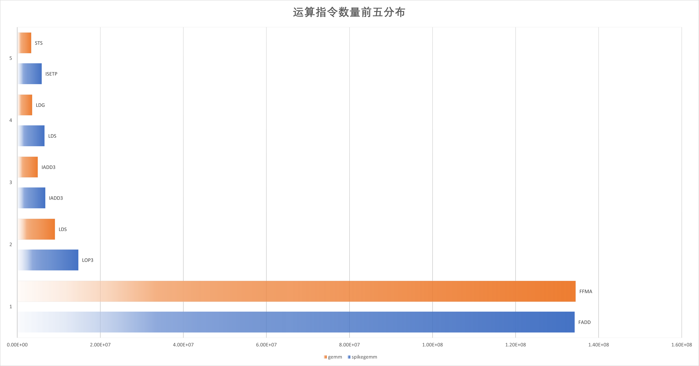
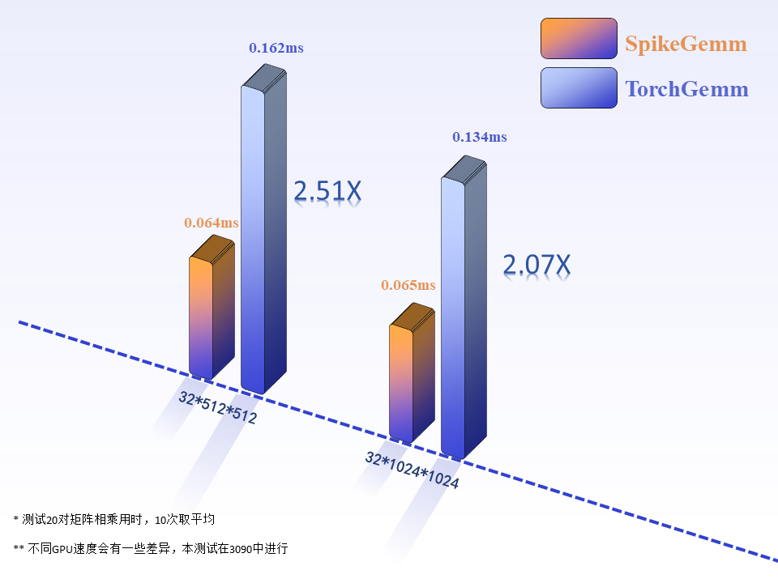
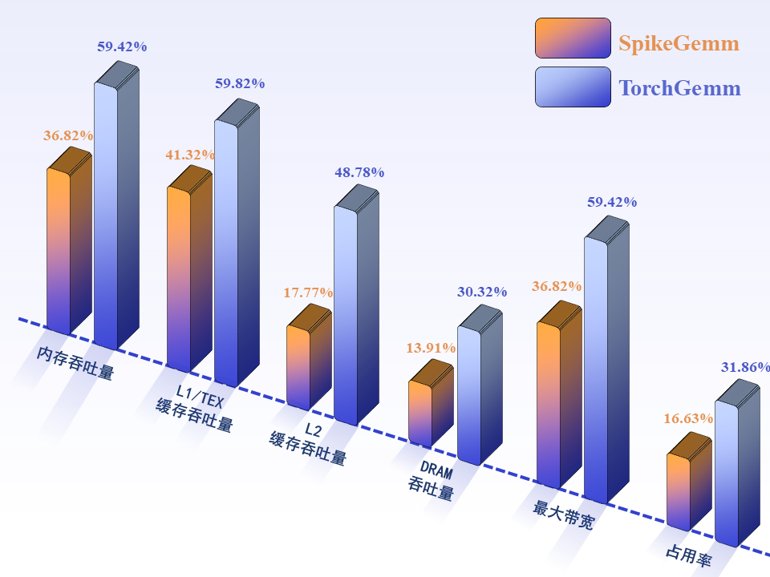

# SNNGrow

<p align="center">
  	
</p> 

[English](./README.md) | 中文(Chinese)

SNNGrow是一款低能耗大规模脉冲神经网络训练和运行框架，本项目不依赖专门设计的硬件实现底层节能的脉冲计算模式，充分利用脉冲特性。本项目使用Cutlass开发针对脉冲数据的基础运算（如GEMM），将高功耗的乘加运算替换成低功耗的加法运算，同时进一步利用脉冲的二值特性降低存储和带宽开销，带来数倍的提速和存储节省。SNNGrow在保持低能耗的同时，提供大规模SNN优异的学习能力，从而以高效率模拟生物体的认知大脑。

SNNGrow的愿景是解码人类智能及其进化机制，并为未来人与 人工智能共生社会中研制受脑启发的的智能体提供支持。

- **[文档](https://snngrow.readthedocs.io/)**
- **[代码](https://github.com/snngrow/snngrow/)**

## 安装
SNNGrow提供两种安装方式，在终端中分别运行以下命令都能安装项目：
### 一、本地安装（推荐）：
1、安装依赖PyTorch
2、本地安装CUDA，请确保CUDA版本和Pytorch的CUDA版本一致
3、克隆我们的github仓库：
```
git clone https://github.com/snngrow/snngrow.git
```
4、进入目录，使用setuptools本地安装：
```
cd snngrow
python setup.py install
```
### 二、从PyPI上安装精简版，精简版不支持脉冲计算模式：
```
pip install snngrow
```


## 快速上手

SNNGrow的代码风格和Pytorch保持一致
您可以使用简单的代码构建脉冲神经网络
```
from snngrow.base import utils
from snngrow.base.neuron import LIFNode
import torch

x = torch.randn(2, 3, 5, 5)

net = torch.nn.Sequential(
    nn.Conv2d(1, 32, kernel_size=3),
    LIFNode(),
    nn.Flatten(),
    nn.Linear(54, 1)
)

y = net(x)
utils.reset(net)
```
如果使用脉冲计算模式，构建网络的例子如下：
```
import torch
import torch.nn as nn
from snngrow.base.neuron.LIFNode import LIFNode
from snngrow.base.surrogate import Sigmoid
import snngrow.base.nn as snngrow_nn
class SimpleNet(nn.Module):
    def __init__(self, T):
        super(SimpleNet, self).__init__()
        self.T = T
        self.surrogate = Sigmoid.Sigmoid(spike_out=True)
        self.classifier = nn.Sequential(
            nn.Flatten(),
            nn.Linear(28 * 28, 512),
            LIFNode(T=T, spike_out=True, surrogate_function=self.surrogate),
            snngrow_nn.Linear(512, 512, spike_in=True),
            LIFNode(T=T, spike_out=True, surrogate_function=self.surrogate),
            snngrow_nn.Linear(512, 128, spike_in=True),
            nn.Linear(128, 10)
        )
```

## 超低能耗稀疏脉冲神经网络计算

SNNGrow支持低功耗的脉冲稀疏计算，针对脉冲数据，自定义了一个SpikeTensor的数据结构，得益于脉冲的二值化特性，这个数据结构在底层使用低比特的存储，只需要1Byte来存储脉冲数据。同时，针对SpikeTensor，SNNGrow使用CUDA和CUTLASS定制低能耗的算子，如针对SpikeTensor的矩阵乘法，真正地实现从底层将乘法替换成加法。

可视化GPU上脉冲矩阵乘法和torch的矩阵乘法指令调用情况，在SNNGrow中，相比于torch，实现了完全使用加法运算来进行矩阵乘法，这将节省非常多的能耗，同时减少对存储的需求。

<p align="center">
  	
</p> 

SNNGrow将会带来数倍的速度提升，我们实测了矩阵乘法的速度，和同规模的torch矩阵乘法相比，SNNGrow可以带来2倍以上的速度提升。

<p align="center">
  	
</p> 

得益于脉冲的数据形式，SNNGrow只要求更少的内存占用和带宽需求，这意味着在同样的硬件资源下，SNNGrow可以运行更大的模型。

<p align="center">
  	
</p> 


## 开发计划

SNNGrow仍在持续开发中：
- [x] 深度脉冲神经网络支持
- [x] 超低能耗稀疏脉冲神经网络计算
- [ ] 脑启发学习算法支持
- [ ] 仿生结构支持

## 引用

如果您在自己工作中使用了SNNGrow，请您考虑用如下格式引用：
```
@misc{SNNGrow,
    title = {SNNGrow},
    author = {Lei, Yunlin and Gao, Lanyu and Yang, Xu and other contributors},
    year = {2024},
    publisher = {GitHub},
    journal = {GitHub repository},
    howpublished = {\url{https://github.com/snngrow/snngrow}},
}
```
## 项目信息


北京理工大学[AETAS实验室](https://www.aetasbit.com/), 清华大学[DSP-LAB](dsp.ime.tsinghua.edu.cn), 北京师范大学和[北京市优智创芯有限公司](https://www.utarn.com/w/home)是本项目的主要开发者。
